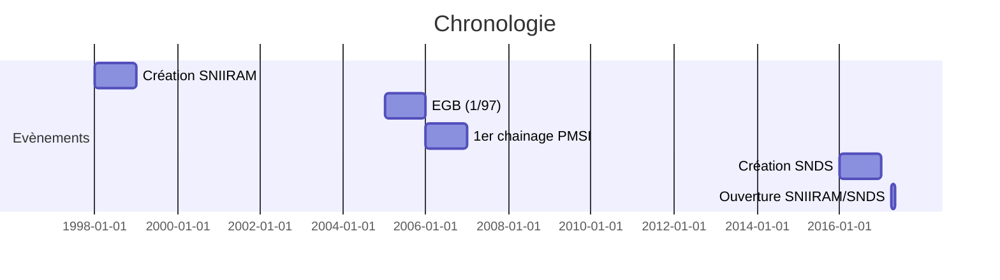

---
layout: post
title: "Mémo SNIIRAM/SNSD"
date: 2017-09-09
---

# Creation du SNIIRAM

[Bon Wiki sur le SNIIRAM](http://open-data-assurance-maladie.ameli.fr/wiki-sniiram/index.php/)
+ **1998**: Loi de financement de la Sécurité Sociale et création **SNIIRAM**[^1] validé par la CNIL en 2001 et le ministère en en 2002. 
**But**: Suivre la globalité des dépenses tous régimes.
 Le SNIIRAM est "Exhaustif/Individuel/Pseudonymisé/Chaîné[^2]

+ **2014**: Rapport BRAS, Décision d'ouvrir plus largement les données avec une ouverture publique des données agrégées ($\neq$ entre publications gratuites et extractions payantes)

+ **2016**: Création du **SNDS**[^3] dont la vocation est de regrouper 
	* les données d'Assurance Maladie (SNIIRAM), 
	* les données des établissements de santé (PMSI), 
	* les causes médicales de décès (CepiDC), 
	* les données des Maisons Départementales des Personnes Handicapées (MDPH), 
	* un échantillon représentatif des données de remboursement des organismes complémentaires (AMC). 

Cette création du SNDS donne lieu à une révision des conditions d'exploitation du SNIIRAM dont l'accès est prolongé en l'état jusqu'en janvier 2019. Il existe 2 processus d'accès aux données comportant un risque de ré-identification: 
* Des organismes habilités ont un  accès permanent avec des périmètres fixés par décrets 
* Des projets de recherches peuvent être lancés après validation par l'INDS[^4] et le CEREES[^5]

# Conditions d'accès et sécurité
## Accès permanents
Une Autorité d'Enregistrement (AE) par organisme habilité dont dépend l'ouverture des comptes, les droits et la clôture pour chaque agent de son organisme d'appartenance (accès nominatifs). Il faut que chaque agent ait suivi la formation architecture ainsi qu'une autre formation pour le DCIR[^6] et l'EGB[^7] (quantités de données accessibles).
L'accès se fait par  un portail central avec des N° de compte demandés par l'AE. 
Des profils d'accès sont établis afin de préciser le niveau d'agrégation et l'exhaustivité autorisés pour l'ensemble des champs de la base.
**Cas de la DREES:** historique de 9 ans + année en cours, sur la France entière puis les différents code d'accès selon l'agrégation. La possibilité de croiser les données potentiellement identifiantes[^8] est attribuée pour l'exploitation du SNDS.

## Sécurité du SNDS
Les exigences de sécurité ont été renforcées et homogénéisées pour toutes les modalités d'accès. Les bases sources (SNDS central géré par la CNAMTS) et filles autorisées doivent se conformer au référentiel de sécurité établi par la CNIL en mars 2017. 
**But**: Couvrir le risque d'atteinte à la vie privée
Chaque organisme doit désigner un CIL[^9] garant de la traçabilité des traitements réalisés.

Entre toute les sources le NIR devient l'identifiant de santé entre toutes les sources. 

# Circuit et Alimentation des Données
## Contrôle qualité
Contrôle qualité commun avec harmonisation inter-régime et répertoires nationaux d'identification, contrôle qualité _MIROIR_ avant intégration dans le SNDS. Aucun rejet de flux mais signalements d'anomalies. 

## Données brutes

+ Soins de ville, détail par date de soins et de remboursement: 
	* Prestations remboursées avec codage (actes médicaux, biologie, dispositifs médicaux, médicaments)
	* Indicateurs de montants (présenté, base de remboursement, remboursé)
+ Soins en établissement: 
	* Directement facturés à l'AM (clinique privée et une partie du secteur médico-social handicap)
	* Séjours du PMSI pour tous les établissements de santé pour les disciplines MCOO[^10] , SSR[^11], HAD[^12], PSY
+ Offre de soins:
	* Spécialité et catégorie du prescripteur et de l'exécutant
	* Lieu d'exécution (cabinet de ville, clinique établissement de santé)
	* Département et commune d'implantation du cabinet 
	* statut conventionnel (libéral) et juridique (établissement) 
+ Infos patients:
	* Âge, sexe, commune et département de résidence
	* Bénéfice de la CMU-C[^13] et de l'ACS[^14]
	* Diagnostic de l'Affection Longue Durée (ALD), date de décès
	* Causes médicales de décès (CepiDC)
+ Pathologies traitées, [code CIM 10](http://www.who.int/classifications/icd/en/) par:
	* ALD
	* PMSI
	* Enregistrement par la consommation de soins (types antidiabétiques --> diabète)
+ Limites du SNIIRAM (données absentes):
	* Pas de résultat d'examen clinique[^15]
	*  Infos partielles sur la conso des personnes en EHPAD et pas d'infos sur l'hospitalisation en long séjour
	* Pas de données sociales (excepté CMU-C/ACS)

## Données AM,  concepts

+ Nature de prestations codés en B2(lettres) ou en PS5 (0000)
+ Nature de prestations de référence = actes déclencheurs du paiement (B2 et PS5)

## Alimentation
**Périodicité**: Quotidienne pour le régime général, mensuel pour les autres régimes, annuelle pour l'ATIH (excepté mensuelle pour le PMSI MCO) 
**Historique**: 19 ans + l'année en cours puis archivage 10 ans
**Accès**:  l'entrepôt source alimente des produits de restitution qui sont accéder par les utilisateurs du SNIIRAM/SNDS. Ces produits sont mis à jour une vois par mois (ou 2 fois pour le DAMIR et le DCIR)

# Open Data
Bases Open Damir, Open Medic et Open Bio sur le [site d'Ameli.fr](http://open-data-assurance-maladie.ameli.fr/index.php)

[^1]: Système National d'Informations Inter Régimes d'Assurance Maladie
[^2]:  Ambulatoire/hospitalisation: données de remboursement (PMSI) uniquement
[^3]: Système National des Données de Santé
[^4]: Institut National de Données de Santé
[^5]: Comité d’Expertise pour les Recherches, les Études et les Évaluations dans le domaine de la Santé
[^6]: Données individuelles des bénéficiaires
[^7]: Echantillon Général des Bénéficiaires (1/97^e^=660k personnes)
[^8]: Cinq variables potentiellement identifiantes:
 Commune de résidence, mois/année de naissance, date des soins (jj/mm/année), date de décès, code de la commune de décès
 [^9]: Correspondant Informatique et Libertés (DREES ???)
 [^10]: Médecine-Chirurgie-Obstétrique-O
 [^11]: Soins de Suite et de Réadaptation
 [^12]: Hospitalisation A Domicile
 [^13]: Couverture Maladie Universelle Complémentaire
 [^14]: Aide à la Complémentaire Santé
 [^15]: Croisement possible (juridiquement) avec les entrepôts de données ? (APHP, Rennes, Bordeaux, Toulouse??)
