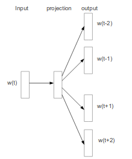

# Words representations, background

In NLP, continuous word representations have become common since the popularization of word2vec by Mikolov in 2013. Using the skip-gram architecture, they constructed word representations by taking the weights of a neural network designed to predict the context of a input word. This model is trained on a large corpus in an unsupervised manner, leading to word representations for each word in the training corpus.

Continuous word representation showed crucial improvement in a large range of nlp tasks, allowing to make use of large unlabbeled data before applying any supervised model. They are now commonly used as the first layer of neural network models, sometimes together with character levels represenations. They tends to capture the general context of a word as well as syntactic features.

# Language model representation

Already described in Peters et al. 2017, the idea to use internal representation of a language model to build context dependant word vectors has been further developped in Peters et al. 2018. The goal is to obtained reacher word representations that can be easily incorpored in supervised model for a specific task.  It can be very useful to infer the syntactic and semantic specifitis of a word in its context. For example a play could refer either to a sport game or to a theater spectacle. Elmo can help disambiguate the meaning of such words given their context. 

# The model

Brief recall on language models:

$$p(x_1..x_T) = \prod^T_{t = 1} p(x_t|x_{t-1}..x_1)$$

# Results