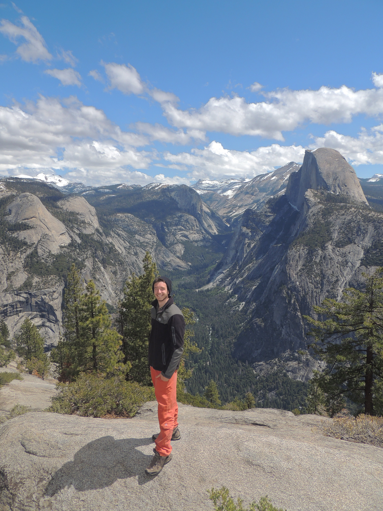

# About me:

First raised in Lyon, I went up to Paris to study Applied Mathematics and other stuffs at [Ecole Polytechnique](https://www.polytechnique.edu/) in the wonderful technopole of Paris-Saclay. I completed a master in statistical learning at [ENSAE](http://www.ensae.fr/ensae/fr/formations-navhorizontale-172/statisticien-conomiste-navhorizontale-48/3me-anne-voies-de-spcialisation-formationsdiplome-96/data-science-cours-3a.html) and another master of Artificial Intelligence at ENS Paris-Saclay [Mathématiques, Vision et Apprentissage](http://math.ens-paris-saclay.fr/version-francaise/formations/master-mva/). 

I am currently working at the Paris Hospitals (APHP) on NLP tasks such as anonymization and bio-medical named entity recognition.

I am passionate about NLP, machine learning, data representation-exploitation, climbing and drawing. 

